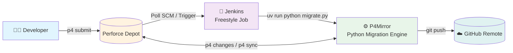
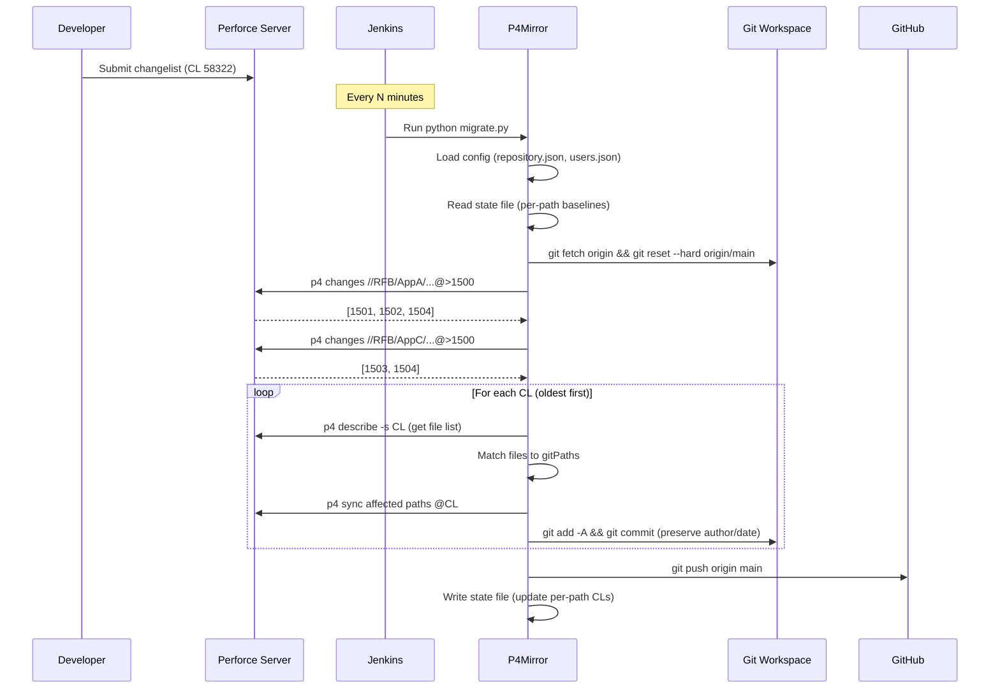
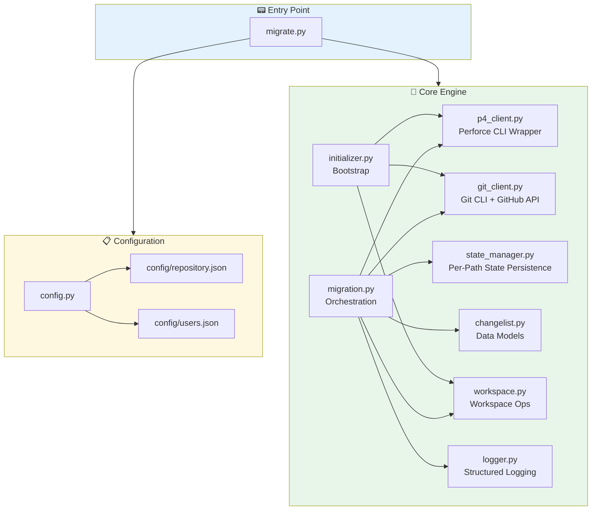
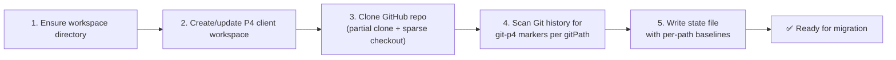
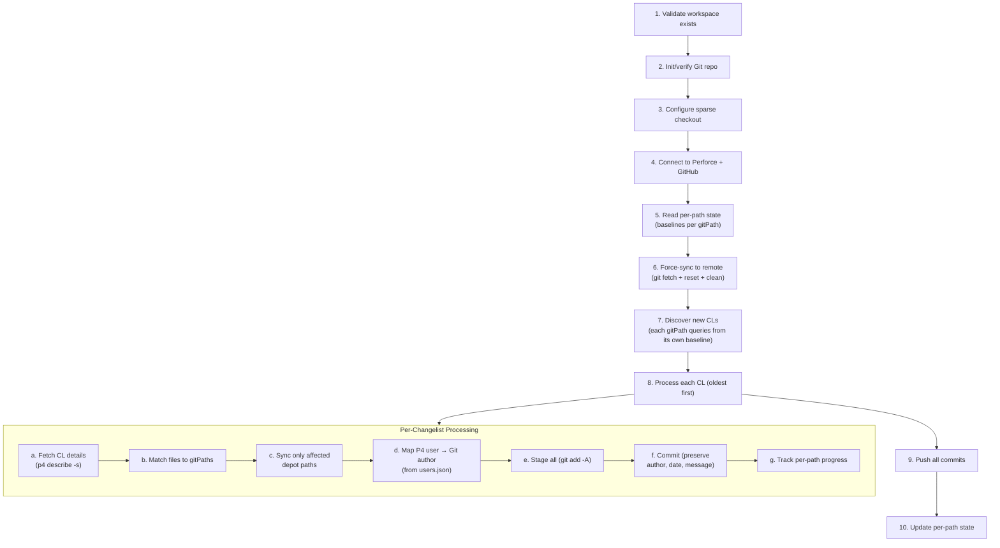
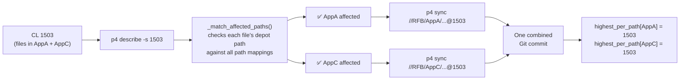

# P4Mirror
## Incremental Perforce → GitHub Migration Framework
### Team Demo — July 2026

---

# Section 1: The Problem

## Why Migrate from Perforce?

| Perforce (P4) | GitHub |
|---|---|
| Centralized VCS — single point of failure | Distributed — every clone is a full backup |
| No modern code review workflows | PRs, code reviews, approvals built-in |
| CLI-based, limited CI integration | Rich ecosystem (Actions, Apps, APIs) |
| Branching is expensive (full file copies) | Branching is cheap (pointer-based) |
| Limited community / industry adoption | Industry standard — tens of millions of repos |

## The Real Problem

> **"We can't just flip a switch."**

Most teams have years of history in Perforce. A **one-time migration** is risky and incomplete because developers **still submit to Perforce** while the team transitions.

**The hard questions:**

- How do we **keep both systems in sync** during the transition?
- How do we **preserve history** (author, timestamp, message, file changes)?
- What happens when a Perforce changelist spans **multiple repos** or **subfolders**?
- How do we **recover from failures** mid-migration?
- How do we **scale** this to 10+ repositories?

---

# Section 2: Why P4Mirror Exists

## The Motivation

P4Mirror was built to answer those questions — a **lightweight, resumable, incremental** migration framework that:

- **Bridges the gap** during Perforce → GitHub transition
- **Preserves full history** — 1 Perforce changelist = 1 Git commit
- **Runs on a schedule** (Jenkins freestyle job) — no special infrastructure
- **Survives failures** — pick up where you left off
- **Is reusable** — new repos need only a config file, not code changes

## What Makes It Different

| Approach | Problem |
|---|---|
| **One-time migration tools** (`git-p4`, `p4-fast-export`) | Can't handle ongoing incremental sync |
| **Manual sync** | Error-prone, doesn't scale |
| **Jenkins Pipeline scripts** | Overly complex, hard to maintain |
| **P4Mirror ✅** | Simple, incremental, resumable, config-driven |

---

# Section 3: Why This Matters

## Business Value

| Impact | How P4Mirror Delivers |
|---|---|
| **Risk reduction** | Incremental = reversible. Failures stop one CL, not the whole migration |
| **Team productivity** | Developers can work in Perforce AND see results in GitHub minutes later |
| **Historical integrity** | Every Git commit has the original author, timestamp, and message |
| **Audit trail** | Commit messages include the Perforce CL number for traceability |
| **Zero infrastructure cost** | Just `p4.exe`, `git`, and Python — runs on any Jenkins agent |
| **Operational simplicity** | One Freestyle job per repo — no Pipeline scripts, no plugins |

---

# Section 4: System Architecture

## High-Level Data Flow



**1 changelist → 1 commit. Period.**

## The 10,000-Foot View



---

# Section 5: Component Architecture



## Module Responsibilities

| Module | Job | Interacts With |
|---|---|---|
| `migrate.py` | CLI entry point. Routes to `init` or `migrate` | Config, Core modules |
| `config.py` | Loads & validates JSON configs | `repository.json`, `users.json` |
| `migration.py` | **The conductor** — orchestrates the full migration flow | Every other module |
| `p4_client.py` | Wraps `p4.exe` commands (changes, describe, sync) | Perforce server |
| `git_client.py` | Wraps `git` commands + GitHub API | Local Git repo, GitHub API |
| `state_manager.py` | Reads/writes per-path migration state | `state/*.json` files |
| `changelist.py` | Data models: `Changelist`, `ChangedFile` | Internal |
| `workspace.py` | Git clone, sparse checkout, workspace validation | Filesystem |
| `initializer.py` | One-time bootstrap (init command) | P4, Git, Workspace |
| `logger.py` | Timestamped logs to console + file | Filesystem |

---

# Section 6: Incremental Migration — Step by Step

## The `init` Command (One-Time Bootstrap)



## The `migrate` Command (Every Run)



## Concrete Example

Let's trace through a real scenario:

### Starting State

```
Config path_mappings:
  • //RFB/AppA/... → AppA/
  • //RFB/AppC/... → AppC/

State file (state/state_ApplicationA.json):
  {
    "paths": {
      "AppA": { "last_migrated_cl": 1003 },
      "AppC": { "last_migrated_cl": 1001 }
    }
  }
```

### Step-by-Step Trace

| Step | What Happens |
|---|---|
| **1. Load config** | Read `repository.json` + `users.json` |
| **2. Read state** | AppA baseline = CL 1003, AppC baseline = CL 1001 |
| **3. Force-sync** | `git fetch origin` → `git reset --hard origin/main` → `git clean -fd` |
| **4. Discover** | `p4 changes //RFB/AppA/...@>1003` → `{1502, 1503}` |
| | `p4 changes //RFB/AppC/...@>1001` → `{1501, 1503}` |
| | **Union + sort:** `[1501, 1502, 1503]` |
| **5. CL 1501** | `p4 describe -s 1501` → files only in `AppC` |
| | Sync `//RFB/AppC/...@1501` |
| | Author: `mary` → Mary Jones `<mary.jones@company.com>` |
| | `git add -A` → `git commit` → `highest_per_path[AppC] = 1501` |
| **6. CL 1502** | `p4 describe -s 1502` → files only in `AppA` |
| | Sync `//RFB/AppA/...@1502` |
| | `git commit` → `highest_per_path[AppA] = 1502` |
| **7. CL 1503** | `p4 describe -s 1503` → files in **both** `AppA` AND `AppC` |
| | Sync BOTH `//RFB/AppA/...@1503` AND `//RFB/AppC/...@1503` |
| | Single combined commit → `highest_per_path[AppA] = 1503`, `highest_per_path[AppC] = 1503` |
| **8. Push** | `git push origin main` |
| **9. Save state** | Write back per-path CLs |

### End State

```json
{
  "paths": {
    "AppA": { "last_migrated_cl": 1503 },
    "AppC": { "last_migrated_cl": 1503 }
  },
  "repository": "ApplicationA",
  "branch": "main",
  "last_run": "2026-07-15T10:30:00+00:00"
}
```

**Three changelists → three Git commits. ✅**

---

# Section 7: Per-Path State Tracking

## The Key Innovation

> **Each gitPath tracks its own `last_migrated_cl` — independent progress, one push.**

### Why This Matters

Without per-path tracking, if you have a **single** `last_migrated_cl`:

```json
// ❌ OLD: Single baseline
{ "last_migrated_cl": 1001 }
```

- Both `AppA` and `AppC` always start from CL 1001
- Even though `AppA` was already at CL 1003, you re-query from 1001
- You waste time re-processing / re-syncing already-migrated CLs

With per-path tracking:

```json
// ✅ NEW: Per-path baselines
{
  "paths": {
    "AppA": { "last_migrated_cl": 1003 },
    "AppC": { "last_migrated_cl": 1001 }
  }
}
```

- AppA queries `//RFB/AppA/...@>1003` — picks up at CL 1004
- AppC queries `//RFB/AppC/...@>1001` — picks up at CL 1002
- **No wasted work. Independent progress.**

### Cross-Path Changelists

When a single changelist modifies files in **multiple** gitPaths:



All affected paths are synced in one pass → **one combined commit**. Both paths' CLs are advanced.

---

# Section 8: Live Demo Script

> Ready to present? Here's an annotated walkthrough you can follow.

## Setup (Before Demo)

```bash
# 1. Ensure config is ready
cat config/repository.json
cat config/users.json

# 2. Set GitHub token
set GITHUB_TOKEN=ghs_xxxxxxxxxxxx

# 3. One-time init (if not done already)
uv run python migrate.py init
```

## Demo Walkthrough

```bash
# === STEP 1: Show the config ===
echo "--- repository.json ---"
type config\repository.json

echo ""
echo "--- users.json ---"
type config\users.json

# === STEP 2: Show the state file (if exists) ===
echo "--- Current state ---"
if exist state\state_ApplicationA.json (type state\state_ApplicationA.json) else (echo "No state file yet")

# === STEP 3: Run migration ===
echo ""
echo "--- Running migration ---"
uv run python migrate.py migrate
```

## What to Point Out During the Demo

| When you see... | Say this... |
|---|---|
| `Reading migration state ...` | "Each gitPath has its own baseline — AppA at CL X, AppC at CL Y" |
| `Querying AppA for changes after CL` | "Each path queries Perforce independently from where it left off" |
| `Found N new changelist(s)` | "Results are unioned and sorted oldest-first" |
| `Affected gitPaths: ['AppA']` | "Only paths touched by this CL are synced — nothing else" |
| `Syncing //RFB/AppC/... to CL` | "Notice we only sync what changed" |
| `Creating commit: Mary Jones` | "Original author preserved in Git" |
| `Pushing commits ...` | "All commits pushed at once" |
| `Updating per-path state ...` | "Each path's CL is saved independently" |

## Expected Output (Annotated)

```
============================================================
P4Mirror Migration Run
Start time:       2026-07-15T10:00:00+00:00
============================================================

[INFO]  Validating workspace ...                          ← Checks D:\Jenkins\ApplicationA exists
[INFO]  Initialising Git repository (if needed) ...       ← Clone if first run
[INFO]  Setting up sparse checkout for: ['AppA', 'AppC']  ← Only these dirs
[INFO]  Configuring GitHub authentication ...             ← Embed token in remote URL
[INFO]  Verifying P4 client workspace ...                 ← Confirm p4 client exists
[INFO]  Reading migration state ...
[INFO]  Per-path baselines: {'AppA': 1003, 'AppC': 1001}  ← ← ← KEY MOMENT
[INFO]  Force-syncing local workspace to remote ...       ← git fetch + reset + clean
[INFO]  Querying AppA for changes after CL 1003 ...
[INFO]    AppA: 2 new CL(s) — {1502, 1503}
[INFO]  Querying AppC for changes after CL 1001 ...
[INFO]    AppC: 2 new CL(s) — {1501, 1503}
[INFO]  Found 3 new changelist(s): [1501, 1502, 1503]    ← Union + sorted

[INFO]  Processing changelist 1/3 — CL 1501 ...           ← Oldest first
[INFO]    Affected gitPaths: ['AppC']                     ← Only AppC changed
[INFO]    Syncing //RFB/AppC/... to CL 1501 ...
[INFO]    Creating commit: Mary Jones <mary@co.com>

[INFO]  Processing changelist 2/3 — CL 1502 ...
[INFO]    Affected gitPaths: ['AppA']                     ← Only AppA changed
[INFO]    Syncing //RFB/AppA/... to CL 1502 ...
[INFO]    Creating commit: John Smith <john@co.com>

[INFO]  Processing changelist 3/3 — CL 1503 ...
[INFO]    Affected gitPaths: ['AppA', 'AppC']             ← ← ← CROSS-PATH CL!
[INFO]    Syncing //RFB/AppA/... to CL 1503 ...            ← Both paths synced
[INFO]    Syncing //RFB/AppC/... to CL 1503 ...            ← in one pass
[INFO]    Creating commit: Mary Jones <mary@co.com>

[INFO]  Pushing commits to GitHub ...                     ← All 3 commits pushed
[INFO]  Push succeeded.
[INFO]  Updating per-path state: {'AppA': 1503, 'AppC': 1503}
[INFO]  Migration complete: 3 changelist(s) processed, 3 commit(s) created.

============================================================
Summary
Duration:       45.2 seconds
Changelists:    3
Commits:        3
Push status:    OK
============================================================
```

---

# Section 9: Demo Cheat Sheet

## Quick Commands Reference

```bash
# Init (one-time)
uv run python migrate.py init

# Migrate (incremental)
uv run python migrate.py migrate

# With specific config
uv run python migrate.py migrate --config config/my_repo.json

# With Jenkins build number (for log tracking)
uv run python migrate.py migrate --build-number 1234

# With explicit token
uv run python migrate.py migrate --github-token ghs_xxxxx
```

## Key Talking Points

1. **"Per-path state is the secret sauce"** — Each mapped directory tracks its own CL independently
2. **"Cross-path CLs are handled seamlessly"** — One CL touches multiple paths → one combined commit
3. **"Failures are safe"** — State only updates after successful push; re-run picks up where it left off
4. **"Jenkins is just a trigger"** — Freestyle job, single batch command, zero plugins
5. **"New repos need no code"** — Just a `repository.json`, a P4 workspace, a GitHub repo, and a Jenkins job

## Architecture Quick Diagram (Whiteboard Version)

```
┌─────────┐     ┌──────────┐     ┌───────────┐     ┌────────┐
│Developer│────▶│ Perforce │────▶│  Jenkins  │────▶│GitHub  │
│ (p4)    │     │  Depot   │     │ (Trigger) │     │ Remote │
└─────────┘     └──────────┘     └───────────┘     └────────┘
                                      │
                                      ▼
                               ┌──────────────┐
                               │   P4Mirror   │
                               │ (Python App) │
                               └──────────────┘
                               │  • Read state
                               │  • Query P4
                               │  • Sync paths
                               │  • Commit 1:1
                               │  • Push to GH
                               └──────────────┘
```

---

# Section 10: Q&A Preparation

## Common Questions

| Question | Answer |
|---|---|
| **What if a migration fails mid-way?** | State is NOT updated until push succeeds. Completed commits remain in Git locally. Next run resumes from the last saved state. |
| **How do we add a new repository?** | 1) Create P4 workspace → 2) Create GitHub repo → 3) Copy P4Mirror → 4) Edit `repository.json` → 5) Run `init` → 6) Create Jenkins job. No code changes. |
| **What about deleted files in P4?** | They're `git add -A`'d — Git detects deletions via `p4 sync`. |
| **Does it support branches?** | Currently single-branch (`default_branch`). Designed for mainline mirroring. |
| **What if a P4 user has no email?** | Falls back to `p4 user -o` lookup. If that also fails, uses `<username>@unknown`. |
| **How do we know it worked?** | Every commit has a `[P4MIRROR: ... change = N]` marker. You can verify by checking `git log` or the GitHub API. |
| **Is it fast?** | Each CL is a single `p4 sync`, `git add`, `git commit`. For typical daily use (5-20 CLs), runs in under a minute. |
| **What if two repos share Perforce paths?** | Each repo has its own config and state. They operate independently — no conflicts. |

---

# Glossary

| Term | Definition |
|---|---|
| **CL / Changelist** | A Perforce changelist — one unit of work submitted to the depot |
| **Depot Path** | A Perforce path like `//RFB/AppA/...` |
| **GitPath** | The relative directory in the Git repo (e.g. `AppA/`). Maps 1:1 from a depot path |
| **Path Mapping** | A `{p4_path, git_path}` pair — the bridge between Perforce and Git |
| **Per-Path State** | Each gitPath independently tracks its `last_migrated_cl` |
| **Cross-Path CL** | A changelist that modifies files in multiple gitPaths |
| **Sparse Checkout** | Git feature that checks out only specific subdirectories |
| **Baseline** | The CL number from which a gitPath resumes querying |
| **State File** | `state/state_<repo>.json` — stores per-path migration checkpoints |
| **`[P4MIRROR: ...]`** | Marker embedded in each commit message linking it to a P4 changelist |

---

> **P4Mirror — Incremental Perforce to GitHub Migration Framework**
>
> Questions? Comments? Let's discuss!
